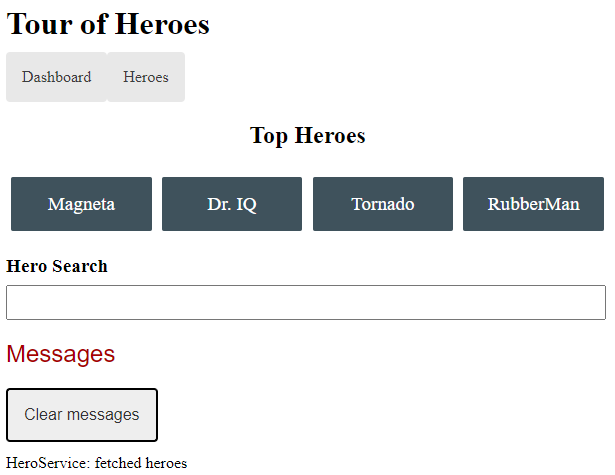
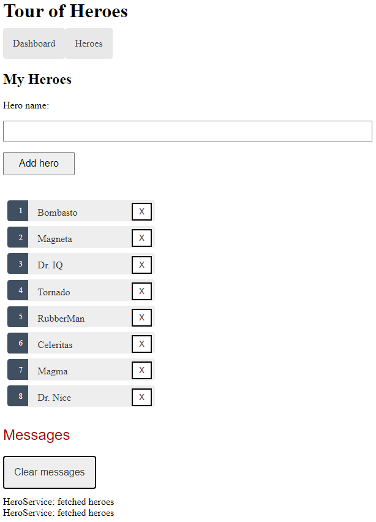

<h1 align="center">
  Tour of Heroes 🦸
</h1>

  <a href="#-description">Description</a> •
  <a href="#-features">Features</a> •
  <a href="#-technologies">Technologies</a> •
  <a href="#-how-to-start-the-program">How to start the program</a> •
  <a href="#-screenshots">Screenshots</a>

## 📃 Description
This is a simple program with a client-server architecture, in which the user can view, add and edit heroes, information about which is stored in a database on the server side. 
The front-end part is written using the Angular framework and the TypeScript programming language. And the backend part is written in Java and the Spring Boot framework

## 🚀 Features
The Tour of Heroes application helps manage its stable of heroes. 
The application has many of the features that you'd expect to find in any data-driven application:
- Gets a list of heroes
- Displays the heroes in a list
- Edits a selected hero's details
- Navigates between different views of heroic data

## 🧑‍💻 Technologies
| Technology     | Version |
|:---------------|:--------|
| JDK            | 17      |
| Maven          | 4.0.0   |
| MySQL          | 8.0.22  |
| Spring Boot    | 3.0.2   |
| Liquibase      | 4.9.1   |
| Lombok         | 1.8.24  |
| Angular        | 15.1.2  |
| npm            | 9.3.1   |

## 📎 How to start the program
### Run backend:
1. Download and extract the file [TourOfHeroes-backend-docker.zip](https://github.com/pavlogook/tour-of-heroes/releases/tag/backend)
2. In the folder open terminal and run `docker-compose up` (you need to have installed [Docker](https://www.docker.com/products/docker-desktop/) on your machine)
3. The backend part must start successfully

### Run frontend:
4. Install npm by the [link](https://docs.npmjs.com/downloading-and-installing-node-js-and-npm)
5. Clone the project from GitHub
6. Open terminal in folder `/frontend` and run `npm start` (if you started the backend part in another way, don't forget to change your port in [proxy.conf.json](https://github.com/pavlogook/tour-of-heroes/blob/51866b84df58e8ebe7ddd02893d880ed46d9e513/frontend/proxy.conf.json#L3)
7. When the compilation is completed successfully, open the [link](http://localhost:4200) in your browser
8. Enjoy the program 😉

## ✨ Screenshots
### Dashboard

---
### Heroes

